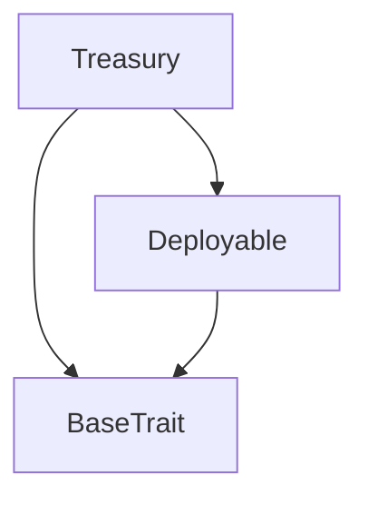

# Tact compilation report
Contract: Treasury
BoC Size: 1140 bytes

## Structures (Structs and Messages)
Total structures: 22

### DataSize
TL-B: `_ cells:int257 bits:int257 refs:int257 = DataSize`
Signature: `DataSize{cells:int257,bits:int257,refs:int257}`

### SignedBundle
TL-B: `_ signature:fixed_bytes64 signedData:remainder<slice> = SignedBundle`
Signature: `SignedBundle{signature:fixed_bytes64,signedData:remainder<slice>}`

### StateInit
TL-B: `_ code:^cell data:^cell = StateInit`
Signature: `StateInit{code:^cell,data:^cell}`

### Context
TL-B: `_ bounceable:bool sender:address value:int257 raw:^slice = Context`
Signature: `Context{bounceable:bool,sender:address,value:int257,raw:^slice}`

### SendParameters
TL-B: `_ mode:int257 body:Maybe ^cell code:Maybe ^cell data:Maybe ^cell value:int257 to:address bounce:bool = SendParameters`
Signature: `SendParameters{mode:int257,body:Maybe ^cell,code:Maybe ^cell,data:Maybe ^cell,value:int257,to:address,bounce:bool}`

### MessageParameters
TL-B: `_ mode:int257 body:Maybe ^cell value:int257 to:address bounce:bool = MessageParameters`
Signature: `MessageParameters{mode:int257,body:Maybe ^cell,value:int257,to:address,bounce:bool}`

### DeployParameters
TL-B: `_ mode:int257 body:Maybe ^cell value:int257 bounce:bool init:StateInit{code:^cell,data:^cell} = DeployParameters`
Signature: `DeployParameters{mode:int257,body:Maybe ^cell,value:int257,bounce:bool,init:StateInit{code:^cell,data:^cell}}`

### StdAddress
TL-B: `_ workchain:int8 address:uint256 = StdAddress`
Signature: `StdAddress{workchain:int8,address:uint256}`

### VarAddress
TL-B: `_ workchain:int32 address:^slice = VarAddress`
Signature: `VarAddress{workchain:int32,address:^slice}`

### BasechainAddress
TL-B: `_ hash:Maybe int257 = BasechainAddress`
Signature: `BasechainAddress{hash:Maybe int257}`

### Deploy
TL-B: `deploy#946a98b6 queryId:uint64 = Deploy`
Signature: `Deploy{queryId:uint64}`

### DeployOk
TL-B: `deploy_ok#aff90f57 queryId:uint64 = DeployOk`
Signature: `DeployOk{queryId:uint64}`

### FactoryDeploy
TL-B: `factory_deploy#6d0ff13b queryId:uint64 cashback:address = FactoryDeploy`
Signature: `FactoryDeploy{queryId:uint64,cashback:address}`

### TreasuryBalanceRequest
TL-B: `treasury_balance_request#433452c9 queryId:int257 mintAmount:int257 receiver:address = TreasuryBalanceRequest`
Signature: `TreasuryBalanceRequest{queryId:int257,mintAmount:int257,receiver:address}`

### TreasuryBalanceResponse
TL-B: `treasury_balance_response#894f25e2 queryId:int257 mintAmount:int257 receiver:address treasuryBalance:int257 = TreasuryBalanceResponse`
Signature: `TreasuryBalanceResponse{queryId:int257,mintAmount:int257,receiver:address,treasuryBalance:int257}`

### SetBotWalletAddress
TL-B: `set_bot_wallet_address#44c4d544 botWalletAddress:address = SetBotWalletAddress`
Signature: `SetBotWalletAddress{botWalletAddress:address}`

### BotWithdraw
TL-B: `bot_withdraw#fb28c5f1 amount:int257 destination:address = BotWithdraw`
Signature: `BotWithdraw{amount:int257,destination:address}`

### SetVoraTokenAddress
TL-B: `set_vora_token_address#f27a9e54 voraTokenAddress:address = SetVoraTokenAddress`
Signature: `SetVoraTokenAddress{voraTokenAddress:address}`

### Treasury$Data
TL-B: `_ owner:address voraTokenAddress:address botWalletAddress:address = Treasury`
Signature: `Treasury{owner:address,voraTokenAddress:address,botWalletAddress:address}`

### Mint
TL-B: `mint#fc708bd2 amount:int257 receiver:address = Mint`
Signature: `Mint{amount:int257,receiver:address}`

### TokenNotification
TL-B: `token_notification#f676e459 queryId:int257 amount:int257 from:address forwardPayload:remainder<slice> = TokenNotification`
Signature: `TokenNotification{queryId:int257,amount:int257,from:address,forwardPayload:remainder<slice>}`

### VoraToken$Data
TL-B: `_ owner:address treasuryAddress:address totalSupply:coins maxSupply:coins = VoraToken`
Signature: `VoraToken{owner:address,treasuryAddress:address,totalSupply:coins,maxSupply:coins}`

## Get methods
Total get methods: 1

## get_balance
No arguments

## Exit codes
* 2: Stack underflow
* 3: Stack overflow
* 4: Integer overflow
* 5: Integer out of expected range
* 6: Invalid opcode
* 7: Type check error
* 8: Cell overflow
* 9: Cell underflow
* 10: Dictionary error
* 11: 'Unknown' error
* 12: Fatal error
* 13: Out of gas error
* 14: Virtualization error
* 32: Action list is invalid
* 33: Action list is too long
* 34: Action is invalid or not supported
* 35: Invalid source address in outbound message
* 36: Invalid destination address in outbound message
* 37: Not enough Toncoin
* 38: Not enough extra currencies
* 39: Outbound message does not fit into a cell after rewriting
* 40: Cannot process a message
* 41: Library reference is null
* 42: Library change action error
* 43: Exceeded maximum number of cells in the library or the maximum depth of the Merkle tree
* 50: Account state size exceeded limits
* 128: Null reference exception
* 129: Invalid serialization prefix
* 130: Invalid incoming message
* 131: Constraints error
* 132: Access denied
* 133: Contract stopped
* 134: Invalid argument
* 135: Code of a contract was not found
* 136: Invalid standard address
* 138: Not a basechain address
* 14438: Unauthorized request for Treasury Balance
* 14796: Exceeds max supply
* 22230: Already set
* 24170: Mint amount exceeds 10x Treasury TON balance limit
* 37849: Bot wallet not set
* 54615: Insufficient balance
* 55238: Only bot can withdraw
* 56382: Only Treasury can respond
* 57579: Only owner can mint
* 58190: Only owner can set
* 59518: Only owner can withdraw directly

## Trait inheritance diagram

## Contract dependency diagram

