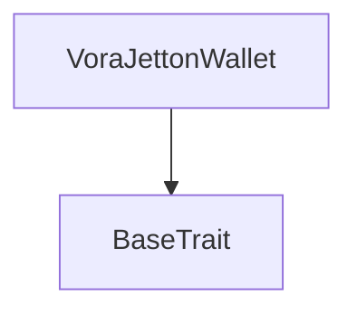
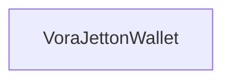

# Tact compilation report
Contract: VoraJettonWallet
BoC Size: 1878 bytes

## Structures (Structs and Messages)
Total structures: 29

### DataSize
TL-B: `_ cells:int257 bits:int257 refs:int257 = DataSize`
Signature: `DataSize{cells:int257,bits:int257,refs:int257}`

### SignedBundle
TL-B: `_ signature:fixed_bytes64 signedData:remainder<slice> = SignedBundle`
Signature: `SignedBundle{signature:fixed_bytes64,signedData:remainder<slice>}`

### StateInit
TL-B: `_ code:^cell data:^cell = StateInit`
Signature: `StateInit{code:^cell,data:^cell}`

### Context
TL-B: `_ bounceable:bool sender:address value:int257 raw:^slice = Context`
Signature: `Context{bounceable:bool,sender:address,value:int257,raw:^slice}`

### SendParameters
TL-B: `_ mode:int257 body:Maybe ^cell code:Maybe ^cell data:Maybe ^cell value:int257 to:address bounce:bool = SendParameters`
Signature: `SendParameters{mode:int257,body:Maybe ^cell,code:Maybe ^cell,data:Maybe ^cell,value:int257,to:address,bounce:bool}`

### MessageParameters
TL-B: `_ mode:int257 body:Maybe ^cell value:int257 to:address bounce:bool = MessageParameters`
Signature: `MessageParameters{mode:int257,body:Maybe ^cell,value:int257,to:address,bounce:bool}`

### DeployParameters
TL-B: `_ mode:int257 body:Maybe ^cell value:int257 bounce:bool init:StateInit{code:^cell,data:^cell} = DeployParameters`
Signature: `DeployParameters{mode:int257,body:Maybe ^cell,value:int257,bounce:bool,init:StateInit{code:^cell,data:^cell}}`

### StdAddress
TL-B: `_ workchain:int8 address:uint256 = StdAddress`
Signature: `StdAddress{workchain:int8,address:uint256}`

### VarAddress
TL-B: `_ workchain:int32 address:^slice = VarAddress`
Signature: `VarAddress{workchain:int32,address:^slice}`

### BasechainAddress
TL-B: `_ hash:Maybe int257 = BasechainAddress`
Signature: `BasechainAddress{hash:Maybe int257}`

### Deploy
TL-B: `deploy#946a98b6 queryId:uint64 = Deploy`
Signature: `Deploy{queryId:uint64}`

### DeployOk
TL-B: `deploy_ok#aff90f57 queryId:uint64 = DeployOk`
Signature: `DeployOk{queryId:uint64}`

### FactoryDeploy
TL-B: `factory_deploy#6d0ff13b queryId:uint64 cashback:address = FactoryDeploy`
Signature: `FactoryDeploy{queryId:uint64,cashback:address}`

### TokenTransfer
TL-B: `token_transfer#0f8a7ea5 queryId:uint64 amount:coins destination:address response_destination:address custom_payload:Maybe ^cell forward_ton_amount:coins forward_payload:remainder<slice> = TokenTransfer`
Signature: `TokenTransfer{queryId:uint64,amount:coins,destination:address,response_destination:address,custom_payload:Maybe ^cell,forward_ton_amount:coins,forward_payload:remainder<slice>}`

### TokenTransferInternal
TL-B: `token_transfer_internal#178d4519 queryId:uint64 amount:coins from:address response_destination:address forward_ton_amount:coins forward_payload:remainder<slice> = TokenTransferInternal`
Signature: `TokenTransferInternal{queryId:uint64,amount:coins,from:address,response_destination:address,forward_ton_amount:coins,forward_payload:remainder<slice>}`

### TokenNotification
TL-B: `token_notification#7362d09c queryId:uint64 amount:coins from:address forward_payload:remainder<slice> = TokenNotification`
Signature: `TokenNotification{queryId:uint64,amount:coins,from:address,forward_payload:remainder<slice>}`

### TokenBurn
TL-B: `token_burn#595f07bc queryId:uint64 amount:coins response_destination:address custom_payload:Maybe ^cell = TokenBurn`
Signature: `TokenBurn{queryId:uint64,amount:coins,response_destination:address,custom_payload:Maybe ^cell}`

### TokenBurnNotification
TL-B: `token_burn_notification#7bdd97de queryId:uint64 amount:coins sender:address response_destination:address = TokenBurnNotification`
Signature: `TokenBurnNotification{queryId:uint64,amount:coins,sender:address,response_destination:address}`

### TokenExcesses
TL-B: `token_excesses#d53276db queryId:uint64 = TokenExcesses`
Signature: `TokenExcesses{queryId:uint64}`

### TokenUpdateContent
TL-B: `token_update_content#af1ca26a content:^cell = TokenUpdateContent`
Signature: `TokenUpdateContent{content:^cell}`

### MasterSetWalletStatus
TL-B: `master_set_wallet_status#5fa19ccc queryId:uint64 target_owner:address is_frozen:bool = MasterSetWalletStatus`
Signature: `MasterSetWalletStatus{queryId:uint64,target_owner:address,is_frozen:bool}`

### WalletSetStatus
TL-B: `wallet_set_status#8b7e28b2 queryId:uint64 is_frozen:bool = WalletSetStatus`
Signature: `WalletSetStatus{queryId:uint64,is_frozen:bool}`

### SetPublicKey
TL-B: `set_public_key#57529e8d public_key:int257 = SetPublicKey`
Signature: `SetPublicKey{public_key:int257}`

### RelayedTransfer
TL-B: `relayed_transfer#8dc15c87 queryId:uint64 amount:coins destination:address response_destination:address custom_payload:Maybe ^cell forward_ton_amount:coins relayer_fee:coins valid_until:uint32 signature:^slice forward_payload:remainder<slice> = RelayedTransfer`
Signature: `RelayedTransfer{queryId:uint64,amount:coins,destination:address,response_destination:address,custom_payload:Maybe ^cell,forward_ton_amount:coins,relayer_fee:coins,valid_until:uint32,signature:^slice,forward_payload:remainder<slice>}`

### Mint
TL-B: `mint#fc708bd2 amount:int257 receiver:address = Mint`
Signature: `Mint{amount:int257,receiver:address}`

### JettonData
TL-B: `_ totalSupply:int257 mintable:bool owner:address content:Maybe ^cell walletCode:^cell = JettonData`
Signature: `JettonData{totalSupply:int257,mintable:bool,owner:address,content:Maybe ^cell,walletCode:^cell}`

### JettonWalletData
TL-B: `_ balance:int257 owner:address master:address walletCode:^cell = JettonWalletData`
Signature: `JettonWalletData{balance:int257,owner:address,master:address,walletCode:^cell}`

### VoraToken$Data
TL-B: `_ totalSupply:coins owner:address content:Maybe ^cell mintable:bool = VoraToken`
Signature: `VoraToken{totalSupply:coins,owner:address,content:Maybe ^cell,mintable:bool}`

### VoraJettonWallet$Data
TL-B: `_ balance:coins owner:address master:address is_frozen:bool public_key:Maybe int257 = VoraJettonWallet`
Signature: `VoraJettonWallet{balance:coins,owner:address,master:address,is_frozen:bool,public_key:Maybe int257}`

## Get methods
Total get methods: 1

## get_wallet_data
No arguments

## Exit codes
* 2: Stack underflow
* 3: Stack overflow
* 4: Integer overflow
* 5: Integer out of expected range
* 6: Invalid opcode
* 7: Type check error
* 8: Cell overflow
* 9: Cell underflow
* 10: Dictionary error
* 11: 'Unknown' error
* 12: Fatal error
* 13: Out of gas error
* 14: Virtualization error
* 32: Action list is invalid
* 33: Action list is too long
* 34: Action is invalid or not supported
* 35: Invalid source address in outbound message
* 36: Invalid destination address in outbound message
* 37: Not enough Toncoin
* 38: Not enough extra currencies
* 39: Outbound message does not fit into a cell after rewriting
* 40: Cannot process a message
* 41: Library reference is null
* 42: Library change action error
* 43: Exceeded maximum number of cells in the library or the maximum depth of the Merkle tree
* 50: Account state size exceeded limits
* 128: Null reference exception
* 129: Invalid serialization prefix
* 130: Invalid incoming message
* 131: Constraints error
* 132: Access denied
* 133: Contract stopped
* 134: Invalid argument
* 135: Code of a contract was not found
* 136: Invalid standard address
* 138: Not a basechain address
* 3688: Not mintable
* 4429: Invalid sender
* 14534: Not owner
* 20358: Account is frozen
* 41096: Signature expired
* 48401: Invalid signature
* 51971: Public key not set
* 54615: Insufficient balance

## Trait inheritance diagram

## Contract dependency diagram

