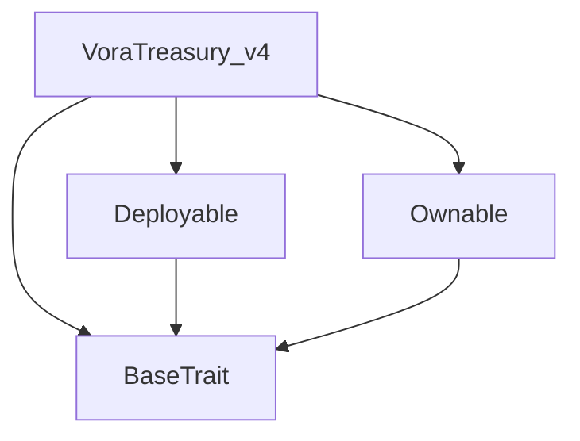
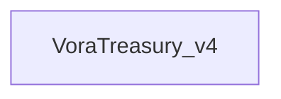

# Tact compilation report
Contract: VoraTreasury_v4
BoC Size: 2632 bytes

## Structures (Structs and Messages)
Total structures: 24

### DataSize
TL-B: `_ cells:int257 bits:int257 refs:int257 = DataSize`
Signature: `DataSize{cells:int257,bits:int257,refs:int257}`

### SignedBundle
TL-B: `_ signature:fixed_bytes64 signedData:remainder<slice> = SignedBundle`
Signature: `SignedBundle{signature:fixed_bytes64,signedData:remainder<slice>}`

### StateInit
TL-B: `_ code:^cell data:^cell = StateInit`
Signature: `StateInit{code:^cell,data:^cell}`

### Context
TL-B: `_ bounceable:bool sender:address value:int257 raw:^slice = Context`
Signature: `Context{bounceable:bool,sender:address,value:int257,raw:^slice}`

### SendParameters
TL-B: `_ mode:int257 body:Maybe ^cell code:Maybe ^cell data:Maybe ^cell value:int257 to:address bounce:bool = SendParameters`
Signature: `SendParameters{mode:int257,body:Maybe ^cell,code:Maybe ^cell,data:Maybe ^cell,value:int257,to:address,bounce:bool}`

### MessageParameters
TL-B: `_ mode:int257 body:Maybe ^cell value:int257 to:address bounce:bool = MessageParameters`
Signature: `MessageParameters{mode:int257,body:Maybe ^cell,value:int257,to:address,bounce:bool}`

### DeployParameters
TL-B: `_ mode:int257 body:Maybe ^cell value:int257 bounce:bool init:StateInit{code:^cell,data:^cell} = DeployParameters`
Signature: `DeployParameters{mode:int257,body:Maybe ^cell,value:int257,bounce:bool,init:StateInit{code:^cell,data:^cell}}`

### StdAddress
TL-B: `_ workchain:int8 address:uint256 = StdAddress`
Signature: `StdAddress{workchain:int8,address:uint256}`

### VarAddress
TL-B: `_ workchain:int32 address:^slice = VarAddress`
Signature: `VarAddress{workchain:int32,address:^slice}`

### BasechainAddress
TL-B: `_ hash:Maybe int257 = BasechainAddress`
Signature: `BasechainAddress{hash:Maybe int257}`

### Deploy
TL-B: `deploy#946a98b6 queryId:uint64 = Deploy`
Signature: `Deploy{queryId:uint64}`

### DeployOk
TL-B: `deploy_ok#aff90f57 queryId:uint64 = DeployOk`
Signature: `DeployOk{queryId:uint64}`

### FactoryDeploy
TL-B: `factory_deploy#6d0ff13b queryId:uint64 cashback:address = FactoryDeploy`
Signature: `FactoryDeploy{queryId:uint64,cashback:address}`

### ChangeOwner
TL-B: `change_owner#819dbe99 queryId:uint64 newOwner:address = ChangeOwner`
Signature: `ChangeOwner{queryId:uint64,newOwner:address}`

### ChangeOwnerOk
TL-B: `change_owner_ok#327b2b4a queryId:uint64 newOwner:address = ChangeOwnerOk`
Signature: `ChangeOwnerOk{queryId:uint64,newOwner:address}`

### TokenTransfer
TL-B: `token_transfer#0f8a7ea5 query_id:uint64 amount:coins destination:address response_destination:address custom_payload:Maybe ^cell forward_ton_amount:coins forward_payload:remainder<slice> = TokenTransfer`
Signature: `TokenTransfer{query_id:uint64,amount:coins,destination:address,response_destination:address,custom_payload:Maybe ^cell,forward_ton_amount:coins,forward_payload:remainder<slice>}`

### ReferrerInfo
TL-B: `_ l1:address l2:address = ReferrerInfo`
Signature: `ReferrerInfo{l1:address,l2:address}`

### SetReferrer
TL-B: `set_referrer#a4b24771 user:address referrer:address = SetReferrer`
Signature: `SetReferrer{user:address,referrer:address}`

### RecordT2EVolume
TL-B: `record_t2_e_volume#1e6b092e user:address amount:coins = RecordT2EVolume`
Signature: `RecordT2EVolume{user:address,amount:coins}`

### WithdrawIDO
TL-B: `withdraw_ido#3fcd0f0d strategy:coins dev:coins dex:coins = WithdrawIDO`
Signature: `WithdrawIDO{strategy:coins,dev:coins,dex:coins}`

### WithdrawSubscription
TL-B: `withdraw_subscription#45f1aa4e strategy:coins tech:coins lp:coins p2p:coins = WithdrawSubscription`
Signature: `WithdrawSubscription{strategy:coins,tech:coins,lp:coins,p2p:coins}`

### VoteBurn
TL-B: `vote_burn#1d49a16f amount:coins = VoteBurn`
Signature: `VoteBurn{amount:coins}`

### PayoutAdvisor
TL-B: `payout_advisor#b0cfda5e amount:coins recipient:address = PayoutAdvisor`
Signature: `PayoutAdvisor{amount:coins,recipient:address}`

### VoraTreasury_v4$Data
TL-B: `_ owner:address vora_jetton_wallet:address referrers:dict<address, ^ReferrerInfo{l1:address,l2:address}> n_volume:dict<address, int> advisor_pool:coins tier5_users:dict<address, bool> tier5_count:int257 strategy_addr:address dev_addr:address dex_addr:address tech_addr:address p2p_addr:address = VoraTreasury_v4`
Signature: `VoraTreasury_v4{owner:address,vora_jetton_wallet:address,referrers:dict<address, ^ReferrerInfo{l1:address,l2:address}>,n_volume:dict<address, int>,advisor_pool:coins,tier5_users:dict<address, bool>,tier5_count:int257,strategy_addr:address,dev_addr:address,dex_addr:address,tech_addr:address,p2p_addr:address}`

## Get methods
Total get methods: 3

## get_dnft_tier
Argument: user

## get_stats
No arguments

## owner
No arguments

## Exit codes
* 2: Stack underflow
* 3: Stack overflow
* 4: Integer overflow
* 5: Integer out of expected range
* 6: Invalid opcode
* 7: Type check error
* 8: Cell overflow
* 9: Cell underflow
* 10: Dictionary error
* 11: 'Unknown' error
* 12: Fatal error
* 13: Out of gas error
* 14: Virtualization error
* 32: Action list is invalid
* 33: Action list is too long
* 34: Action is invalid or not supported
* 35: Invalid source address in outbound message
* 36: Invalid destination address in outbound message
* 37: Not enough Toncoin
* 38: Not enough extra currencies
* 39: Outbound message does not fit into a cell after rewriting
* 40: Cannot process a message
* 41: Library reference is null
* 42: Library change action error
* 43: Exceeded maximum number of cells in the library or the maximum depth of the Merkle tree
* 50: Account state size exceeded limits
* 128: Null reference exception
* 129: Invalid serialization prefix
* 130: Invalid incoming message
* 131: Constraints error
* 132: Access denied
* 133: Contract stopped
* 134: Invalid argument
* 135: Code of a contract was not found
* 136: Invalid standard address
* 138: Not a basechain address
* 31063: Budget error
* 36513: Insufficient advisor pool
* 53440: Noblesse Oblige: Minimum 10 Tier-5 Crew needed to unlock
* 55160: Only Tier-5 Crew can vote
* 59710: Referrer locked

## Trait inheritance diagram

## Contract dependency diagram

